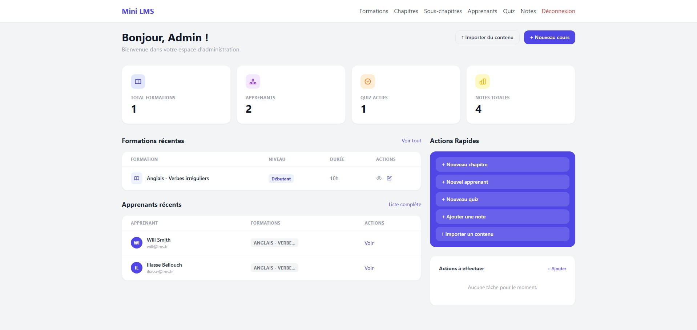

# Mini LMS — Plateforme de gestion de formation

Projet réalisé dans le cadre d'un test technique de stage par **Iliasse Bellouch** (BUT3 Informatique, Sorbonne Paris Nord).

---

## 📋 Présentation

Mini LMS est une plateforme d'apprentissage en ligne (Learning Management System) développée avec Laravel. Elle permet à un administrateur de gérer des formations, chapitres, sous-chapitres, quiz et apprenants, tandis que les apprenants peuvent consulter leurs cours, passer des quiz et suivre leurs notes.

## 📸 Aperçu



---

## 🎥 Démonstration

👉 [Voir la démonstration vidéo du parcours admin : ](https://www.loom.com/share/0725a549efd6468f862c7681c3f945ac) \\
👉 [Voir la démonstration vidéo du parcours apprenant : ](https://www.loom.com/share/69d5a5f8d0fd4be6840ac104c15dc34d)


## 🚀 Fonctionnalités

### Côté Administrateur
- Gestion complète des formations (CRUD)
- Gestion des chapitres et sous-chapitres (CRUD)
- Import de contenus pédagogiques (texte, tableaux)
- Création de quiz avec questions et réponses
- Gestion des apprenants et assignation aux formations
- Saisie et modification des notes
- Consultation des résultats de quiz des apprenants
- Todo list persistante sur le dashboard
- Tableaux de bord avec statistiques

### Côté Apprenant
- Consultation de ses formations et cours
- Navigation paginée dans les contenus
- Passage de quiz interactifs
- Consultation de ses copies de quiz (bonnes/mauvaises réponses)
- Suivi de ses notes et moyenne générale
- Moyenne quiz séparée

---

## ⚙️ Installation

### Prérequis
- PHP 7.4
- Composer
- Node.js + npm

### Étapes

**1. Cloner le projet**
```bash
git clone https://github.com/IliasseB/MiniLMS.git
cd MiniLMS
```

**2. Installer les dépendances PHP**
```bash
composer install
```

**3. Installer les dépendances JavaScript**
```bash
npm install
```

**4. Configurer l'environnement**
```bash
cp .env.example .env
php artisan key:generate
```

**5. Configurer la base de données**

Ouvre `.env` et vérifie ces lignes :

```
DB_CONNECTION=sqlite
DB_DATABASE=/chemin/absolu/vers/database/database.sqlite
```

Crée le fichier SQLite :
```bash
touch database/database.sqlite
```

**6. Lancer les migrations et les seeders**
```bash
php artisan migrate:fresh --seed
```

**7. Compiler les assets**
```bash
npm run dev
```

**8. Lancer le serveur**
```bash
php artisan serve
```

L'application est accessible sur **http://127.0.0.1:8000**

---

## 👤 Comptes de démonstration

| Rôle | Email | Mot de passe |
|------|-------|--------------|
| Administrateur | admin@lms.fr | password |
| Apprenant | will@lms.fr | password |
| Apprenant | iliasse@lms.fr | password |

---

## 🧪 Tests

Lancer les tests PHPUnit :
```bash
php artisan test
```

Les tests couvrent :
- Authentification et contrôle d'accès
- CRUD Formations, Chapitres, Sous-chapitres
- CRUD Apprenants et Notes
- CRUD Contenus importés
- Création et passage de Quiz
- Consultation des résultats
- Dashboard et Todo list

---

## 🗂️ Structure de la base de données

- `users` — Utilisateurs (admin / apprenant)
- `formations` — Formations disponibles
- `chapitres` — Chapitres liés aux formations
- `sous_chapitres` — Sous-chapitres avec contenu pédagogique
- `contenus` — Contenus additionnels
- `contenus_ia` — Contenus importés depuis des sources externes
- `apprenants` — Profils apprenants
- `apprenant_formation` — Table pivot formations/apprenants
- `quiz` — Quiz associés aux sous-chapitres
- `questions` — Questions des quiz
- `reponses` — Réponses aux questions
- `notes` — Notes des apprenants
- `resultats_quiz` — Résultats et copies de quiz
- `todos` — Tâches admin du dashboard

---

## 🛠️ Technologies utilisées

- **Laravel** — Framework PHP (compatible PHP 7.4)
- **Laravel Breeze** — Authentification
- **SQLite** — Base de données
- **Tailwind CSS** — Framework CSS
- **Laravel Mix** — Compilation des assets
- **PHPUnit** — Tests automatisés

---

## 📁 Données de démonstration

Après `php artisan migrate:fresh --seed`, les données suivantes sont disponibles :

**Formation :** Anglais - Verbes irréguliers
- Chapitre : Les verbes irréguliers
  - Sous-chapitre 1 : Définition et présentation (+ 2 contenus importés)
  - Sous-chapitre 2 : 10 verbes indispensables à connaître (+ 1 contenu importé + quiz)
  - Sous-chapitre 3 : Méthode de mémorisation (+ 1 contenu importé)

---

## 👨‍💻 Auteur

**Iliasse Bellouch**
BUT3 Informatique — Sorbonne Paris Nord